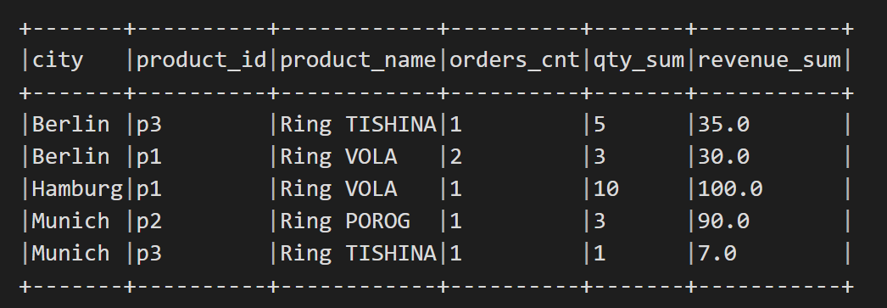

# Mentor-Seminar
# Витрина данных mart_city_top_products
# Ильин Марат Викторович

## Задача
На основе трех таблиц (`users`, `orders`, `products`) рассчитать витрину `mart_city_top_products` со следующими метриками:
- `orders_cnt` — количество заказов;
- `qty_sum` — общее количество проданных единиц;
- `revenue_sum` — сумма выручки (`qty * price`);
- для каждого города выбрать Топ-2 товара по `revenue_sum` используя Window;
- записать результат в s3 и в HDFS по пути : /tmp/sandbox_zeppelin/mart_city_top_products/ (parquet, overwrite);
- прочитать обратно и показать топ-результат.

Итоговая витрина содержит для каждого города топ-2 товара по сумме выручки.

## Структура репозитория

mart-city-top-products_Ilin_Marat/

│

├── result.png

├── README.md   
              
└─── mart_city_top_products.py 

## Результат выполнения
ubuntu@rc1b-dataproc-m-frpjb5en1mrj3sqa:~$ hdfs dfs -ls /tmp/sandbox_zeppelin/mart_city_top_products/

Found 2 items

-rw-r--r--   1 ubuntu hadoop          0 2026-02-26 05:21 /tmp/sandbox_zeppelin/mart_city_top_products/_SUCCESS

-rw-r--r--   1 ubuntu hadoop       2052 2026-02-26 05:21 /tmp/sandbox_zeppelin/mart_city_top_products/part-00000-ff26847e-911f-4016-a7d2-bbeb766360bc-c000.snappy.parquet

